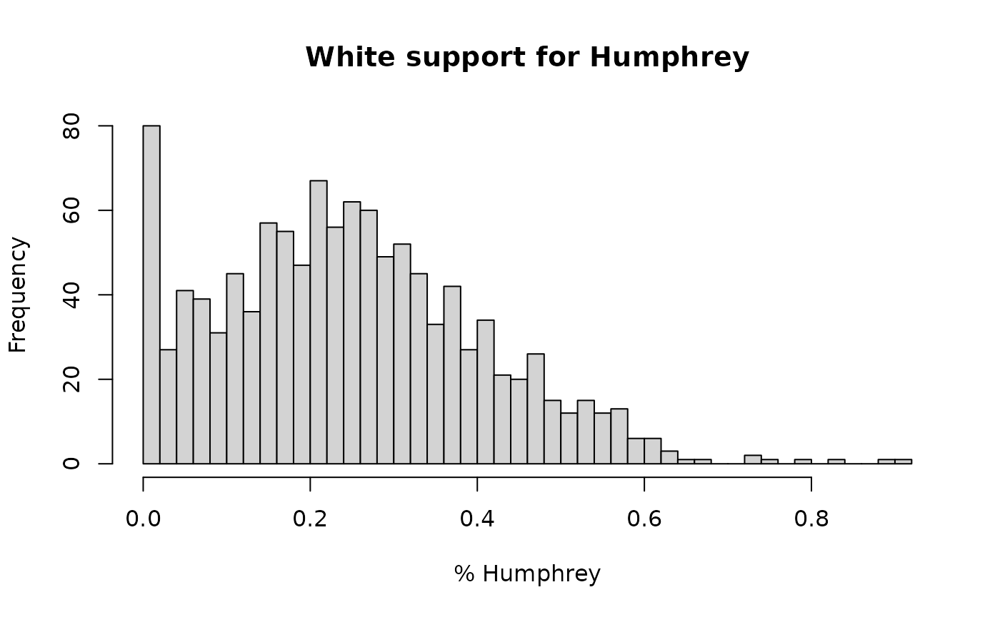

# Local estimates for ecological inference

The main estimation routine in **seine**,
[`ei_est()`](https://corymccartan.com/seine/reference/ei_est.md),
produces *global* estimates, \\\mathbb{E}\[Y\mid X\]\\ for the entire
population under study. Sometimes, however, estimates for each
individual aggregation unit (such as precincts, counties, or other
geographies) are of interest. **seine** provides two approaches for
this.
[`ei_bounds()`](https://corymccartan.com/seine/reference/ei_bounds.md)
computes guaranteed-valid partial identification (Duncan-Davis) bounds
for each unit, relying only on the accounting identity and known limits
on the outcome.
[`ei_est_local()`](https://corymccartan.com/seine/reference/ei_est_local.md)
produces point estimates and confidence intervals under the same
coarsening at random (CAR) assumption that
[`ei_est()`](https://corymccartan.com/seine/reference/ei_est.md) relies
on, plus (for now) an additional homoskedasticity assumption.

## Setting up the analysis

We begin by loading the 1968 election data, and defining an `ei_spec`
object that records the outcome, predictor, covariate, and total-count
columns, following the setup from
[`vignette("seine")`](https://corymccartan.com/seine/articles/seine.md).
We now want to estimate the individual-level association between race
and presidential vote choice *within* each county.

``` r
library(seine)
data(elec_1968)
```

For the bounds, only the data are needed. For
[`ei_est_local()`](https://corymccartan.com/seine/reference/ei_est_local.md),
we also need a fitted regression model, so we set up an `ei_spec` object
and call
[`ei_ridge()`](https://corymccartan.com/seine/reference/ei_ridge.md).

``` r
spec = ei_spec(
    elec_1968,
    predictors = vap_white:vap_other,
    outcome = pres_dem_hum:pres_abs,
    total = pres_total,
    covariates = c(state, pop_city:pop_rural, farm:educ_coll, inc_00_03k:inc_25_99k),
    preproc = function(x) {
        x = model.matrix(~ 0 + ., x) # convert factors to dummies
        bases::b_bart(x, trees = 200)
    }
)

m = ei_ridge(spec)
```

See the main vignette
([`vignette("seine")`](https://corymccartan.com/seine/articles/seine.md))
for a full walkthrough of the estimation workflow.

## Partial identification bounds

The simplest local quantities to compute are partial identification
bounds: for each county and each predictor-outcome combination, the
range of values for the local estimand \\\beta\_{gj} = \Pr(Y = j \mid X
= x_g, G = g)\\ that is consistent with the observed aggregate data.
These bounds require no modeling assumptions beyond the accounting
identity and the specified bounds on the outcome.

[`ei_bounds()`](https://corymccartan.com/seine/reference/ei_bounds.md)
takes an `ei_spec` object (or a formula) and returns a data frame with
one row per unit per predictor-outcome combination. The `bounds`
argument specifies the known limits on the outcome, which are typically
\[0, 1\] for proportions. Without known bounds on the outcome or other
statistical assumptions, the local estimates are completely
unidentified.

``` r
bounds = ei_bounds(spec, bounds = c(0, 1))
head(bounds)
#> # A tibble: 6 × 6
#>    .row predictor outcome      weight    min    max
#>   <int> <chr>     <chr>         <dbl>  <dbl>  <dbl>
#> 1     1 vap_white pres_dem_hum  5877. 0      0.262 
#> 2     2 vap_white pres_dem_hum 16131. 0      0.122 
#> 3     3 vap_white pres_dem_hum  4872. 0      0.397 
#> 4     4 vap_white pres_dem_hum  3566. 0      0.180 
#> 5     5 vap_white pres_dem_hum  8801. 0.0190 0.0382
#> 6     6 vap_white pres_dem_hum  1698. 0      1
```

The `min` and `max` columns give the sharp bounds for each unit. The
`weight` column contains the number of observations in that unit and
predictor group. This column can be used to aggregate estimates across
units.

Since aggregating bounds is a common operation,
[`ei_bounds()`](https://corymccartan.com/seine/reference/ei_bounds.md)
provides the `global = TRUE` argument to automatically compute the
global bounds by taking a weighted average of the local bounds.

``` r
ei_bounds(spec, bounds = c(0, 1), global = TRUE)
#> # A tibble: 12 × 4
#>    predictor outcome            min     max
#>    <chr>     <chr>            <dbl>   <dbl>
#>  1 vap_white pres_dem_hum 0.176     0.375  
#>  2 vap_black pres_dem_hum 0.00467   0.927  
#>  3 vap_other pres_dem_hum 0         1      
#>  4 vap_white pres_rep_nix 0.247     0.421  
#>  5 vap_black pres_rep_nix 0         0.808  
#>  6 vap_other pres_rep_nix 0         0.991  
#>  7 vap_white pres_ind_wal 0.213     0.415  
#>  8 vap_black pres_ind_wal 0.00874   0.946  
#>  9 vap_other pres_ind_wal 0         1.000  
#> 10 vap_white pres_abs     0.0000108 0.00179
#> 11 vap_black pres_abs     0         0.00844
#> 12 vap_other pres_abs     0         0.0910
```

As is common with partial identification, the bounds can be quite wide.
For example, without further assumptions, nothing can be said about the
Black preference for Wallace except that it is between 0.8% and 94.6%.

The [`as.array()`](https://rdrr.io/r/base/array.html) method reformats
the output as a four-dimensional array with dimensions units by
predictors by outcomes by (min, max), which may be convenient for
further analysis.

``` r
dim(as.array(bounds))
#> [1] 1143    3    4    2
```

Bounds on contrasts, such as the difference in vote share between White
and Black voters, can be computed directly by passing a `contrast`
argument. Computing these bounds is more involved and requires solving a
linear program for each unit, but the output is the same format as
above. Here, we calculate bounds on White-Black racially polarized
voting for each candidate.

``` r
ei_bounds(spec, bounds = c(0, 1), contrast = list(predictor = c(1, -1, 0)))
#> # A tibble: 4,572 × 5
#>     .row predictor             outcome         min    max
#>    <int> <chr>                 <chr>         <dbl>  <dbl>
#>  1     1 vap_white - vap_black pres_dem_hum -0.841 0.262 
#>  2     2 vap_white - vap_black pres_dem_hum -0.761 0.122 
#>  3     3 vap_white - vap_black pres_dem_hum -0.623 0.397 
#>  4     4 vap_white - vap_black pres_dem_hum -0.654 0.180 
#>  5     5 vap_white - vap_black pres_dem_hum -0.981 0.0382
#>  6     6 vap_white - vap_black pres_dem_hum -0.742 0.901 
#>  7     7 vap_white - vap_black pres_dem_hum -0.531 0.250 
#>  8     8 vap_white - vap_black pres_dem_hum -0.993 0.183 
#>  9     9 vap_white - vap_black pres_dem_hum -0.474 0.178 
#> 10    10 vap_white - vap_black pres_dem_hum -0.991 0.0855
#> # ℹ 4,562 more rows
```

Note that because contrasts *across* predictor groups involve
fundamentally different numbers of people in each unit, these bounds
cannot be aggregated across units in a meaningful way. For a bound on
the global contrast, you can aggregate non-contrasted bounds and then
take the contrast of the global bounds.

## Estimating the local covariance

Point estimates and confidence intervals from
[`ei_est_local()`](https://corymccartan.com/seine/reference/ei_est_local.md)
require a model for how the local estimands vary around their
conditional mean within each unit. This variation is captured by the
`b_cov` argument, a covariance matrix for the local estimands
\\\beta\_{gj}\\ around the regression prediction.

[`ei_local_cov()`](https://corymccartan.com/seine/reference/ei_local_cov.md)
estimates this covariance from the data, under the CAR assumption and an
additional homoskedasticity condition. A small amount of shrinkage is
applied, controlled by the `prior_obs` argument. Details are provided in
McCartan & Kuriwaki (2025+).

``` r
b_cov = ei_local_cov(m, spec)
round(sqrt(diag(b_cov)), 3)
#> vap_white:pres_dem_hum vap_black:pres_dem_hum vap_other:pres_dem_hum 
#>                  0.078                  0.264                  0.245 
#> vap_white:pres_rep_nix vap_black:pres_rep_nix vap_other:pres_rep_nix 
#>                  0.175                  0.159                  0.323 
#> vap_white:pres_ind_wal vap_black:pres_ind_wal vap_other:pres_ind_wal 
#>                  0.173                  0.329                  0.353 
#>     vap_white:pres_abs     vap_black:pres_abs     vap_other:pres_abs 
#>                  0.008                  0.004                  0.017
round(b_cov[1:3, 1:3], 3)
#>                        vap_white:pres_dem_hum vap_black:pres_dem_hum
#> vap_white:pres_dem_hum                  0.006                 -0.008
#> vap_black:pres_dem_hum                 -0.008                  0.070
#> vap_other:pres_dem_hum                 -0.005                  0.058
#>                        vap_other:pres_dem_hum
#> vap_white:pres_dem_hum                 -0.005
#> vap_black:pres_dem_hum                  0.058
#> vap_other:pres_dem_hum                  0.060
```

The rows and columns are ordered by predictor within outcome, i.e.
(Y1\|X1, Y1\|X2, …, Y2\|X1, Y2\|X2, …). One can visualize the estimated
covariance structure with
[`heatmap()`](https://rdrr.io/r/stats/heatmap.html) or the
[`corrplot`](https://cran.r-project.org/package=corrplot) pacakge.

``` r
heatmap(
    b_cov,
    Rowv = NA,
    col = hcl.colors(n = 100, palette = "Spectral"),
    symm = TRUE,
    mar = c(12, 12)
)
```


We strongly recommend examining the estimated covariance structure and
evaluating if the estimates are plausible. For example, preferences for
Black and Other voters are correlated (blue) and somewhat anticorrelated
with preferences for White voters (orange/red). Support for Humphrey is
generally anticorrelated with support for Nixon and Wallace. These two
patterns make sense in context.

On the other hand, the estimated standard deviation for Black support
for different candidates is quite large, around 0.3, especially compared
to low variation in White preference for e.g. Humphrey, which has
standard deviation just 0.086. As a reminder, these estimates are of the
*residual* variation, after controlling for covariates. Still, we might
be expect redisual variation in Black support to be smaller across the
board, especially for the segregationist Wallace.

## Local point estimates

With the regression model and a covariance structure in hand,
[`ei_est_local()`](https://corymccartan.com/seine/reference/ei_est_local.md)
projects the regression predictions onto the accounting constraint to
produce local estimates that exactly satisfy the ecological identity
within each county. The function also computes asymptotically valid
confidence intervals. Estimates and intervals will be truncated to the
possible values obtained from
[`ei_bounds()`](https://corymccartan.com/seine/reference/ei_bounds.md).

The `b_cov` argument controls the assumed covariance structure. There
are three common choices:

- `b_cov = ei_local_cov(m, spec)`: the **data-estimated covariance**,
  which uses the structure estimated above. *This is the recommended
  choice*.
- `b_cov = 0`: the **orthogonal model**, which assumes no correlation in
  the local estimands across predictors within a unit. When the
  estimated `b_cov` is implausible, this can be an acceptable choice.
- `b_cov = 0.95` (or another value near 1): the **neighborhood model**,
  which assumes nearly perfect positive correlation across predictors.
  This is appropriate when counties are relatively homogeneous and the
  local estimands are expected to vary together. However, it leads to
  quite narrow confidence intervals, which may not cover the truth in
  practice.

Here, we fit all three and compare the average width of the resulting
confidence intervals.

``` r
e_rcov = ei_est_local(m, spec, b_cov = b_cov, bounds = c(0, 1), sum_one = TRUE)
e_orth = ei_est_local(m, spec, b_cov = 0,     bounds = c(0, 1), sum_one = TRUE)
e_nbhd = ei_est_local(m, spec, b_cov = 0.95,  bounds = c(0, 1), sum_one = TRUE)

c(
    estimated = mean(e_rcov$conf.high - e_rcov$conf.low),
    orthogonal = mean(e_orth$conf.high - e_orth$conf.low),
    neighborhood = mean(e_nbhd$conf.high - e_nbhd$conf.low)
)
#>    estimated   orthogonal neighborhood 
#>    0.4165165    0.2876576    0.2334284
```

Setting `sum_one = TRUE` enforces the constraint that the local vote
shares across candidates sum to one within each racial group, which is
the correct restriction for these data. The `bounds = c(0, 1)` argument
truncates estimates to the unit interval and caps the standard errors
implied by the width of the bounds.

We can visualize the distribution of local estimates for a particular
predictor-outcome combination with a histogram.

``` r
hist(
    subset(e_rcov, predictor == "vap_white" & outcome == "pres_dem_hum")$estimate,
    breaks = 50,
    main = "White support for Humphrey",
    xlab = "% Humphrey"
)
```



To examine results for a specific county, we can filter the output.

``` r
subset(e_rcov, .row == 1)
#> # A tibble: 12 × 8
#>     .row predictor outcome      weight estimate std.error conf.low conf.high
#>    <int> <chr>     <chr>         <dbl>    <dbl>     <dbl>    <dbl>     <dbl>
#>  1     1 vap_white pres_dem_hum 5877.   0.111     0.0684   0          0.262 
#>  2     1 vap_black pres_dem_hum 1831.   0.478     0.218    0          0.841 
#>  3     1 vap_other pres_dem_hum   13.3  0.902     0.244    0.176      1     
#>  4     1 vap_white pres_rep_nix 5877.   0.101     0.0293   0.0139     0.102 
#>  5     1 vap_black pres_rep_nix 1831.   0         0.0941   0          0.281 
#>  6     1 vap_other pres_rep_nix   13.3  0.0964    0.233    0          0.791 
#>  7     1 vap_white pres_ind_wal 5877.   0.775     0.0627   0.620      0.934 
#>  8     1 vap_black pres_ind_wal 1831.   0.512     0.200    0          1     
#>  9     1 vap_other pres_ind_wal   13.3  0         0.289    0          0.861 
#> 10     1 vap_white pres_abs     5877.   0.0128    0.00119  0.00927    0.0160
#> 11     1 vap_black pres_abs     1831.   0.0103    0.00385  0          0.0218
#> 12     1 vap_other pres_abs       13.3  0.00123   0.00954  0          0.0297
```

The [`as.array()`](https://rdrr.io/r/base/array.html) method provides a
convenient view of the point estimates as a three-dimensional array.

``` r
head(as.array(e_rcov)[, , "pres_rep_nix"])
#>       vap_white   vap_black  vap_other
#> [1,] 0.10135960 0.00000e+00 0.09636897
#> [2,] 0.13338927 0.00000e+00 0.09824133
#> [3,] 0.07996136 0.00000e+00 0.10443038
#> [4,] 0.07276098 0.00000e+00 0.10519746
#> [5,] 0.22660678 0.00000e+00 0.10231746
#> [6,] 0.11193454 5.20417e-18 0.10583097
```

## References

McCartan, C., & Kuriwaki, S. (2025+). Identification and semiparametric
estimation of conditional means from aggregate data. Working paper
[arXiv:2509.20194](https://arxiv.org/abs/2509.20194).

Chernozhukov, V., Cinelli, C., Newey, W., Sharma, A., & Syrgkanis, V.
(2024). Long story short: Omitted variable bias in causal machine
learning (No. w30302). *National Bureau of Economic Research.*

This vignette was originally produced by a large language model, and
then reviewed and edited by the package authors.
